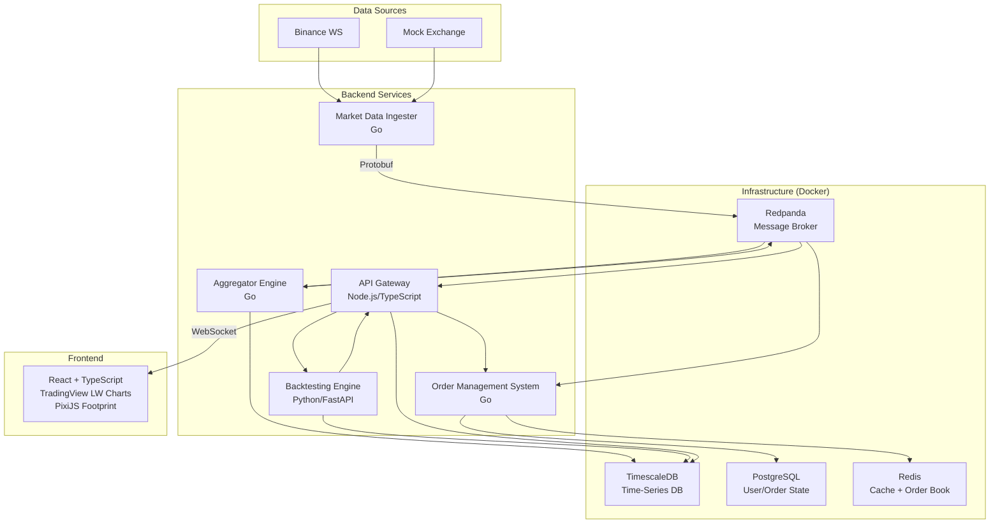

# TradeLens — Enterprise-Grade Trading Platform

A crypto-first, multi-asset-ready trading platform with real-time footprint charts, a backtesting engine, and paper trading — built as a microservices monorepo, testable entirely on localhost via Docker.

## System Overview



## MVP Scope

- End-to-end local data pipeline: Mock Exchange -> Ingester -> Redpanda -> Aggregator -> TimescaleDB.
- Paper trading OMS (market, limit, stop-loss, take-profit).
- Backtesting service with event-driven execution loop.
- API Gateway (REST + WebSocket fan-out).
- React frontend with candlestick and footprint chart rendering.

## Architectural Decisions

- **Message Broker**: Redpanda for Kafka-compatible local-first messaging.
- **Time-Series DB**: TimescaleDB for handling billions of ticks with compression.
- **Relational DB**: PostgreSQL for user accounts, orders, and portfolio state.
- **Serialization**: Protocol Buffers (proto3) for fast, structured shared contracts across Go, Python, and TS.
- **Market**: Binance Spot compatible schema and mock stream format.
- **Strategy language**: Python-first for backtesting strategies.

## Quick Start

1. Copy environment template:

```bash
cp .env.example .env
```

2. Start infrastructure and topics:

```bash
make infra-up
```

3. Start full stack:

```bash
make up
```

4. Open:

- **Frontend**: http://localhost:5173
- **API Gateway**: http://localhost:4000
- **Backtester docs**: http://localhost:8000/docs
- **Redpanda Console**: http://localhost:8080

## Testing

Run all service-level tests:

```bash
make test
```

Run targeted checks:

```bash
make test-pipeline
make test-backtest
```

## Project Layout

- `proto/`: shared protocol contracts.
- `services/`: market-data-ingester, aggregator, oms, backtester, api-gateway, mock-exchange.
- `web/`: React frontend.
- `db/migrations/`: schema bootstrap SQL.
- `scripts/`: helper scripts for local operations.
- `docs/`: architecture and API documentation.

## Notes

- The platform runs without Binance API keys by default via the mock exchange service.
- Live Binance mode can be enabled by setting `EXCHANGE_MODE=binance`.
